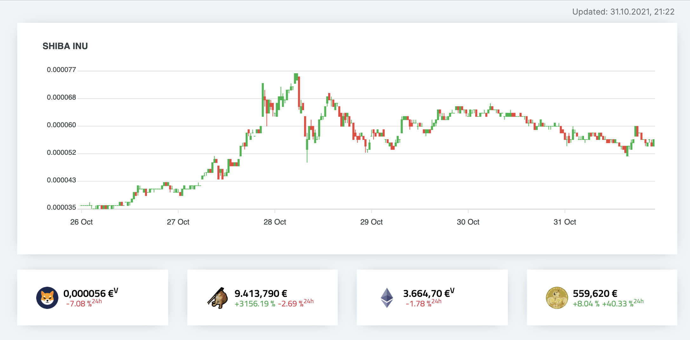

# Crypto Tracker 🐍📈 – Central Portfolio Tracking

[](https://www.python.org/) 
[](https://www.djangoproject.com/) 

### Easy asset tracking – at a glance 🚀



Dashboard to centrally monitor current crypto portfolio developments, by providing an overview of their current value.
Values can either be displayed by their current *Overall value* (requires adding Purchases) or by their *Current value*
(indicated by the <sup>`V`</sup> next to the number).

The current course data is polled from CoinMarketCap's REST API and stored in the database. The API allows you to make 
a maximum of 333 points worth of daily requests (~1 request / 5min). Querying multiple cryptos may increase the 
amounts of points required per API call, thus requires increasing the time between requests.

## ⭐ Features

💸 Personalized crypto portfolio tracking  
💸 Centrally keep an eye on its current value  
💸 Quickly react to emerging changes  
💸 Show overall or current value  
💸 Convert values into local currency  
💸 Chart crypto course  
💸 Soon: alerting via Pushover  

## Deployment 👾

Deployment is best done via Docker – can also be achieved by installing each component manually,
but this is quite tedious, so I'm not going to detail that here.

This application is meant to be run behind e.g. Traefik or a WAF (Web Application Firewall) that handles 
the SSL certificates, such as LetsEncrypt.

Once rolled out the application is reachable via `http://<ip-address>:5000`

### Requirements

* [Docker](https://docs.docker.com/get-docker/)  
* [docker-compose](https://docs.docker.com/compose/install/)  
* [CoinMarketCap API Key](https://coinmarketcap.com/api/)

### Setup

All relevant parameters are controlled via environment variables that are passed
to the docker-compose stack. For further reference review the `config/settings.py` file.

```bash
mv dotenv-sample .env
vi .env
```

* `SECRET_KEY` just set it
* `POSTGRES_PASSWORD` database password
* `SITE_HOSTNAME` name your site is going to be reached at. Multiple values can be space-separated
* `ALLOWED_HOSTS` allowed host headers - should have `SITE_HOSTNAME` values + IPv4 of your Docker host  
* `COINMARKET_KEY` your CoinMarketCap API key used for requests
* `TARGET_CURRENCY` if you wish to convert the USD course + price data to your local currency

### Docker Rollout

```bash
mv docker/docker-compose .
mv docker/rebuild-shortcut rebuild
chmod +x ./rebuild
./rebuild
```

Everything should now be running smoothly. Use a service (`cron` will also do) to start
the process automatically at boot. Alternatively you can also add `-d` to the `docker-compose`
command in `rebuild` and run it manually at each startup.

## Usage 🚀

Once running, access the admin panel via `http://<ip-address>:5000/admin` 
To access it, you will need to create a user using `chmod +x docker/manage-shortcut; ./docker/manage-shortcut createsuperuser`  

Login with the credentials just created, to then add the `Cryptos` you wish to track. 
Once added, `Purchases` enable you to indicate your assets/amount for each crypto.


[](https://www.buymeacoffee.com/alfonsrv)  

---

## TODOs 🛠️

- Resize image  
- Price Alerting
